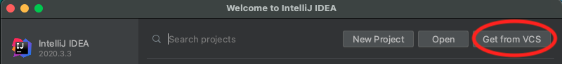

# Project Setup

* You can import the project directly from a *Version Control System*, by providing the following URL: 
TODO

* Otherwise, take care to import the project as a Gradle Project

* If required, trust the project and accept the Gradle auto-import

* Wait until the Gradle indexing process ends (it may take a few seconds)

## ENJOY THE PROJECT!

